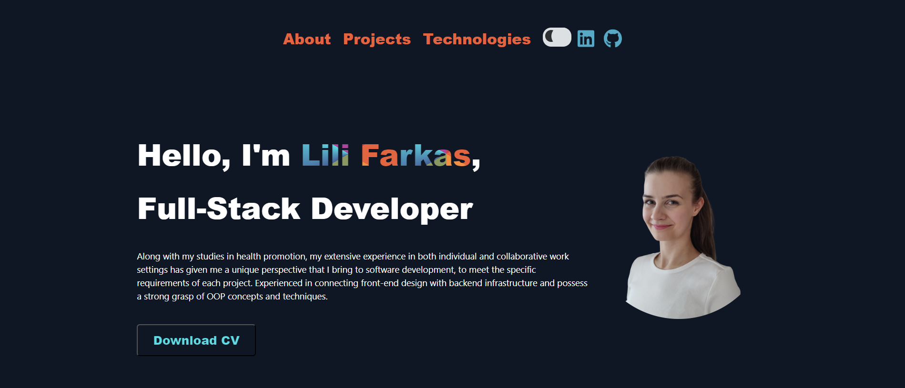

# Portfolio Page

This portfolio page showcases my projects, technologies/stack, and information about me. It is a React application built with Bootstrap and React Spring.

## Table of Contents

- [Preview](#preview)
- [Features](#features)
- [Installation](#installation)
- [Usage](#usage)
- [Technologies Used](#technologies-used)

## Preview



## Features

- Project section to showcase my projects with details and links.
- Technologies/stack section to highlight the technologies I have learned.
- About Me section to provide information about myself.
- Dark mode toggle button for enhanced user experience.
- Slide animations with React Spring library.

## Installation

To run this portfolio page locally, follow these steps:

1. Clone the repository:

```powershell
git clone https://github.com/lilifarkas/portfolio-page.git
```
2. Change into the project directory:

```powershell
cd portfolio-page
```
3. Install the dependencies:

```powershell
npm install
```
## Usage

1. Start the development server:

```powershell
npm start
```

2. Open your browser and visit http://localhost:3000 to see the portfolio page.

## Technologies Used

- React: JavaScript library for building user interfaces.
- Bootstrap: CSS framework for responsive and mobile-first design.
- React Spring: Animation library for React applications.

